# 🧩 SOLID Design Principles

## LSP → ISP → DIP

This lecture completes the remaining SOLID principles:

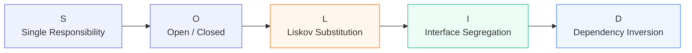

The lecture first revisits **Liskov Substitution Principle (LSP)** because it is considered one of the principles most frequently violated in practice, and then covers **Interface Segregation Principle (ISP)** and **Dependency Inversion Principle (DIP)**.

---

# 1. 🔄 Liskov Substitution Principle (LSP)

## Core Idea

Suppose we have:

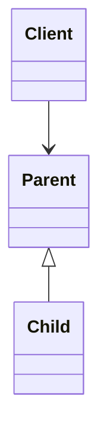

The **client expects a `Parent`**, but we should be able to provide a `Child` without breaking the client's code.

```text
Client expects Parent
        ↓
        │
   give Child
        ↓
Client should still work
```

### Main statement

> **A child class should be able to behave like its parent class.**

The important point from the lecture is:

```text
Inheritance ≠ LSP automatically
```

A child may inherit from a parent but still violate LSP.

The child must not merely **inherit** the parent; it must remain **substitutable** for the parent.

```text
Parent
  ↓
Child

Client should not care
whether it received:

Parent
   OR
Child
```

The client should not suddenly encounter:

* unexpected restrictions
* unexpected exceptions
* unsupported operations
* violated assumptions

This is the central idea behind all the LSP guidelines in the lecture.

---

# 2. 🧭 LSP Guidelines

The lecture divides the LSP guidelines into **three major groups**:

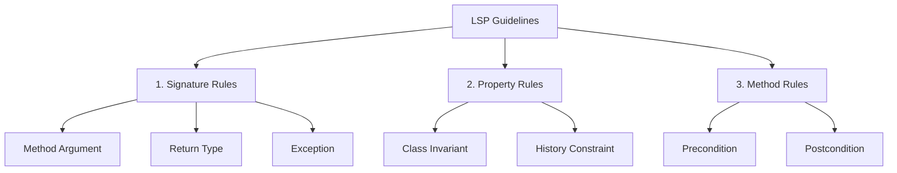

---

# 3. ✍️ Signature Rule

A method's **signature** consists of:

```text
Method Name
+
Arguments
+
Return Type
```

The lecture discusses three rules:

```text
Signature Rule
      │
      ├── Method Argument Rule
      ├── Return Type Rule
      └── Exception Rule
```

---

## 3.1 Method Argument Rule

Suppose:

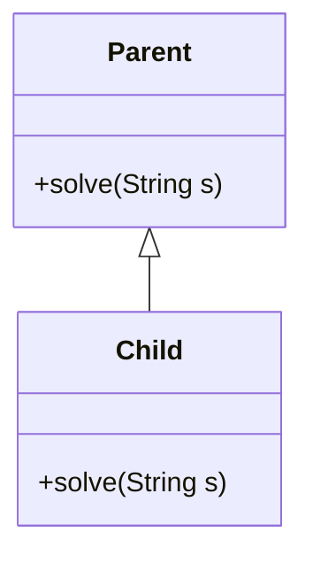

The child override should maintain the required argument contract.

The lecture explains the idea using **same or broader argument acceptance**. The practical C++ example shows that changing the parameter from `string` to `int` means the function no longer overrides the parent's method.

```text
Parent:
solve(string)

Child:
solve(int)   ❌
```

C++ reports that the function does not actually override the base-class member because the signature is different.

### Why does this matter?

The client only knows the parent's contract:

```text
Client
  ↓
Parent.solve(string)
```

If a child suddenly expects something incompatible:

```text
Client
  ↓
Child.solve(int)
```

the client's assumptions no longer hold.

### Interview takeaway

For ordinary C++ overriding:

```cpp
class Parent {
public:
    virtual void solve(string s) = 0;
};

class Child : public Parent {
public:
    void solve(string s) override {
        // correct
    }
};
```

Changing the parameter type means it is not the same override.

---

# 4. ↩️ Return Type Rule

The lecture next uses another hierarchy:

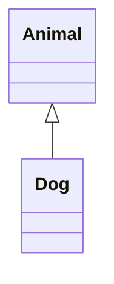

Suppose the parent method returns:

```cpp
Animal* getAnimal();
```

The child can return:

```cpp
Animal* getAnimal();   ✅
```

or a narrower/derived type:

```cpp
Dog* getAnimal();      ✅
```

but not a broader type such as:

```text
Parent of Animal
       ↑
   Animal
       ↑
      Dog
```

The child should not return something **broader than the parent's promised return type**, because the client is expecting something compatible with the parent's contract.

The lecture calls the case where:

```text
Parent → Animal
Child  → Dog
```

**covariance**.

### Visual

```text
              Animal
                 ▲
                 │
                Dog

Parent returns → Animal
Child returns  → Dog ✅

Child returns → broader than Animal ❌
```

### Core rule

```text
Return Type

Same type       ✅
Narrower type   ✅
Broader type    ❌
```

---

# 5. ⚠️ Exception Rule

The third signature-related rule concerns exceptions.

The lecture uses an exception hierarchy such as:

```text
Exception
   │
   ├── Logic Error
   │      └── Out Of Range
   │
   └── Runtime Error
```

Suppose the parent method promises:

```text
M1 → Runtime Error
```

The child may throw:

```text
Runtime Error           ✅
More specific child     ✅
```

but it should not suddenly throw a broader or unrelated exception that the client does not know how to handle.

### Why?

The client is written against the **parent contract**.

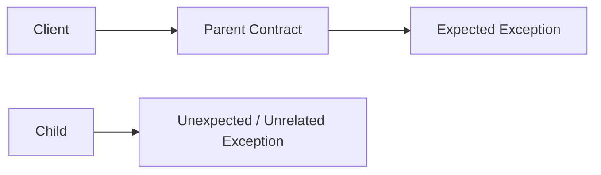

If the child throws an unrelated exception, the client's existing exception-handling logic may not handle it.

The transcript demonstrates this with `Logic Error` and `Runtime Error`; when the child throws a `Runtime Error` while the client is prepared to handle only the expected `Logic Error` hierarchy, the exception goes uncaught.

### Simple memory rule

```text
Parent exception
      ↓
Same exception       ✅
More specific        ✅
Broader / unrelated  ❌
```

---

# 6. 🏠 Property Rule

The second major LSP category is the **Property Rule**.

It has two parts:

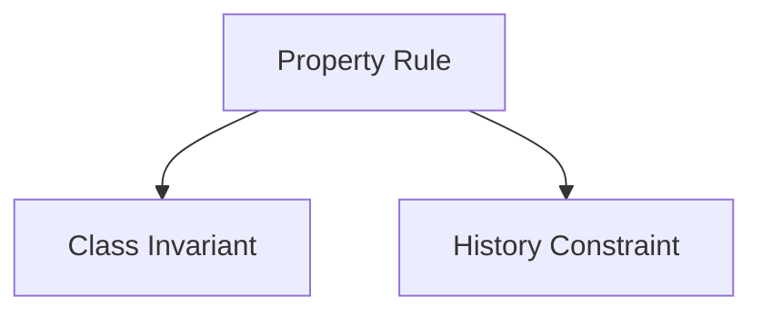

---

# 7. 🔒 Class Invariant

## What is an invariant?

An **invariant** is a rule that should always remain true for a class.

```text
Class Invariant
      ↓
A property / rule
      ↓
Must always remain true
```

The lecture emphasizes that this is not a special C++ operator. It is a **design rule/contract** that the programmer is responsible for maintaining.

---

## 🏦 Example: Bank Account

Suppose:

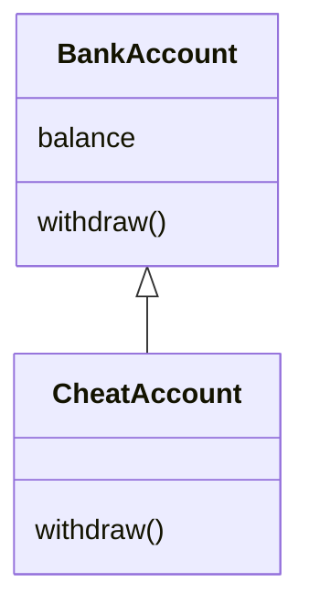

The parent has the invariant:

```text
balance >= 0
```

Therefore:

```text
BankAccount
    ↓
balance can never be negative
```

The normal implementation checks:

```text
withdraw(amount)
       ↓
balance - amount
       ↓
Would balance become negative?
       │
   ┌───┴───┐
   │       │
  YES      NO
   │       │
Error    Withdraw
```

But suppose a child class allows:

```text
Balance = ₹100
Withdraw = ₹200

New balance = -₹100
```

Then:

```text
BankAccount
    ↓
balance >= 0

CheatAccount
    ↓
allows balance < 0 ❌
```

Therefore the child violates the parent's invariant and is not safely substitutable.

The transcript implements this through constructor/withdraw checks and then shows how `CheatAccount` violates the invariant by permitting a negative balance.

---

# 8. 🕰️ History Constraint

The second property rule is the **History Constraint**.

### Core idea

> A child should not change the established behavioral history/contract of the parent.

Think:

```text
Parent establishes a behavior
          ↓
Child must respect it
          ↓
Child must not unexpectedly remove/change it
```

---

## 🏦 Bank Account Example Again

Suppose the parent `BankAccount` provides:

```text
withdraw()
```

and its contract says:

```text
Withdrawal should always be allowed
```

Now create:

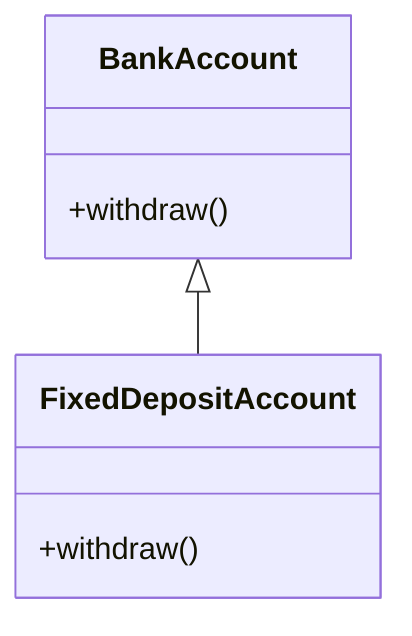

A `FixedDepositAccount` overrides:

```text
withdraw()
     ↓
throw exception
```

because withdrawal is not allowed for that account.

The problem:

```text
Parent:
withdraw() → allowed ✅

Child:
withdraw() → not allowed ❌
```

A client expecting a normal `BankAccount` may call:

```cpp
withdraw();
```

and suddenly receive an exception.

Therefore:

```text
FixedDepositAccount
       ↓
breaks History Constraint
       ↓
breaks LSP
```

This is the same core problem the lecture uses to explain why a fixed-deposit account should not simply be modeled as a substitutable child of a general account abstraction when it cannot support the parent's promised withdrawal behavior.

---

## 🔐 Immutability Point

The lecture also discusses immutable classes/methods in the context of history constraints.

The idea presented is:

```text
Immutable Class
    ↓
Cannot be further inherited

Immutable Method
    ↓
Cannot be overridden
```

It connects this to `final` in C++ and explains that a child should not take behavior that the parent intended to keep fixed and turn it into changeable behavior.

---

# 9. ⚙️ Method Rule

The third LSP category is the **Method Rule**.

It contains:

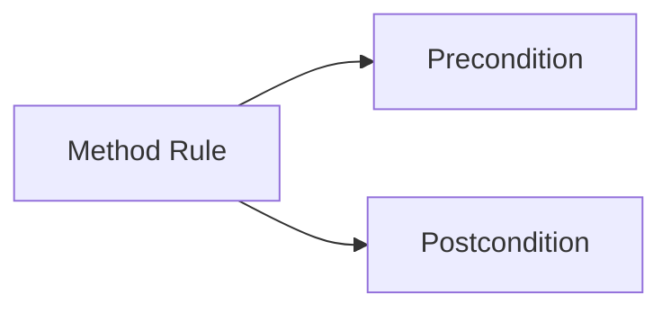

---

# 10. ⬅️ Precondition

## Definition

A **precondition** is a condition that must be satisfied **before a method runs**.

```text
Before method execution
          ↓
Precondition must hold
```

The lecture's main rule:

> A child may keep the same precondition or make it weaker, but should not make it stronger.

In other words:

```text
Parent precondition
        ↓
Child

Same condition    ✅
Weaker condition  ✅
Stronger condition ❌
```

---

## Example 1: Numeric Range

Parent:

```text
M1(number)

0 <= number <= 5
```

So:

```text
Valid:
0 1 2 3 4 5
```

Child can weaken this:

```text
0 <= number <= 10
```

because everything valid for the parent remains valid for the child.

```text
Parent accepts: 0 → 5
Child accepts:  0 → 10

Parent's valid inputs
        ↓
Still valid in Child ✅
```

But suppose the child changes it to:

```text
0 <= number <= 3
```

Then:

```text
Parent accepts 4 ✅
Child rejects 4 ❌
```

The child has strengthened the precondition, so substitutability breaks.

The transcript walks through exactly this 0–5, 0–10, and 0–3 example.

---

## Example 2: Password

A more practical example from the lecture:

### Parent

```text
User.createPassword()
```

Precondition:

```text
password length >= 8
```

### Child

```text
AdminUser.createPassword()
```

The child can make it weaker:

```text
password length >= 6
```

because every password accepted by the parent is still accepted by the child.

```text
Parent → >= 8
Child  → >= 6

8, 9, 10... → accepted by both ✅
```

But:

```text
Parent → >= 8
Child  → >= 10
```

would be stronger and could reject inputs that were valid for the parent.

The transcript also notes that the exact design can depend on the application's use case; if the business requirement strictly requires eight characters, then that condition should remain unchanged.

### 🧠 Memory trick

```text
PRE-condition

Parent: "You must satisfy this."

Child: "I can accept even more." ✅

Child: "I will accept less." ❌
```

---

# 11. ➡️ Postcondition

## Definition

A **postcondition** is a condition that must be true **after a method executes**.

```text
Method executes
      ↓
Postcondition must hold
```

The rule is the opposite of preconditions:

> The child may keep the same postcondition or strengthen it, but should not weaken it.

```text
Parent postcondition
        ↓
Child

Same       ✅
Stronger   ✅
Weaker     ❌
```

---

## 🚗 Car Example

Suppose:

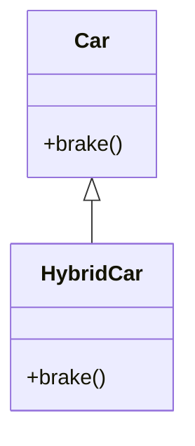

Parent contract:

```text
After brake():
car speed must decrease
```

So:

```text
Car.brake()
    ↓
Speed decreases ✅
```

The child `HybridCar` can provide an even stronger result:

```text
Brake
  ↓
Speed decreases
  +
Battery charge increases
```

This is acceptable because the original promise is still satisfied.

```text
Parent:
speed decreases

Child:
speed decreases
+
charging increases

✅ LSP still holds
```

But if the child says:

```text
Brake
   ↓
Speed does NOT decrease
```

then the parent's postcondition is violated.

The client expects:

```text
brake() → speed decreases
```

but receives different behavior from the child.

The transcript highlights that this can be especially serious for a real vehicle scenario because the client's basic expectation of braking would no longer hold.

---

# 12. 🧠 Complete LSP Rule Summary

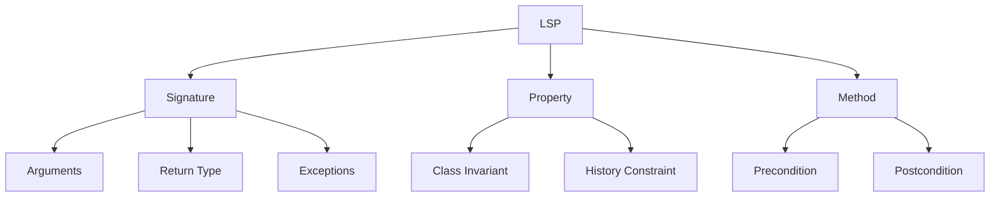

| Rule               | Child should...                                  |
| ------------------ | ------------------------------------------------ |
| Method Argument    | Preserve the parent's usable method contract     |
| Return Type        | Return same or narrower/derived type             |
| Exception          | Throw same or more specific compatible exception |
| Class Invariant    | Preserve or strengthen the invariant             |
| History Constraint | Preserve established parent behavior             |
| Precondition       | Keep same or weaken                              |
| Postcondition      | Keep same or strengthen                          |

---

# 13. 🚨 Common Signs of LSP Violation

The lecture concludes that a child is suspicious when it overrides a parent method but:

```text
❌ Throws an exception because it cannot support the operation
```

```text
❌ Leaves the overridden method effectively empty
```

```text
❌ Replaces expected behavior with an incompatible behavior
```

```text
❌ Introduces hard-coded behavior that violates the parent's contract
```

The `FixedDepositAccount` example is the major illustration: inheriting a `withdraw()` operation but making it unusable means the child is not truly substitutable for the parent.

---

# 14. 🧩 Interface Segregation Principle (ISP)

## Definition

> **Many client-specific interfaces are better than one general-purpose interface.**

The problem occurs when one large interface contains many methods:

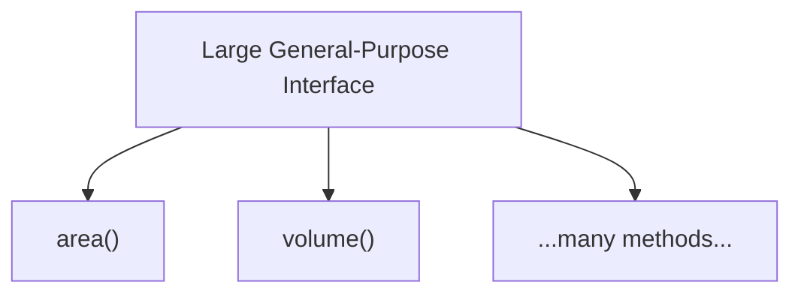

and every child must implement methods even when it doesn't need them.

The lecture's second formulation is:

> **A client should not be forced to implement methods it does not need.**

---

# 15. 📐 ISP Example — Shapes

Suppose we have:

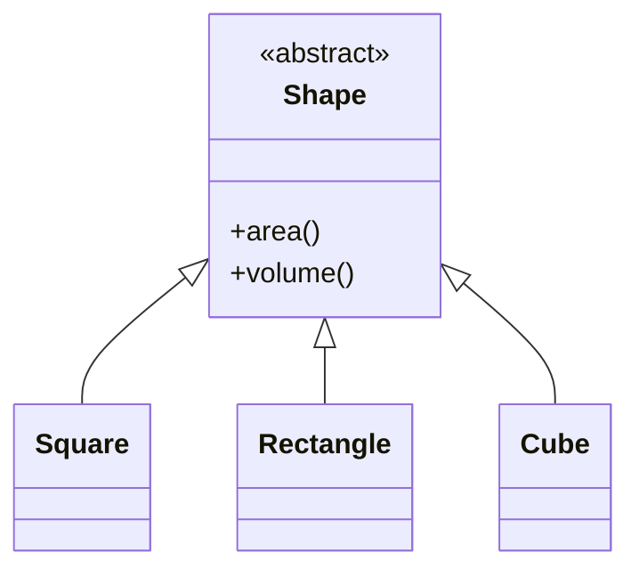

At first this looks reasonable:

```text
Shape
 ├── area()
 └── volume()
```

But:

```text
Square     → Area ✅
Rectangle  → Area ✅
Cube       → Area ✅
Cube       → Volume ✅

Square     → Volume ❌
Rectangle  → Volume ❌
```

Yet because `volume()` is part of the general `Shape` interface, `Square` and `Rectangle` are forced to implement it.

The transcript shows one possible result:

```cpp
volume() {
    throw InvalidArgument();
}
```

That is a sign that the abstraction is too broad.

---

# 16. ✅ ISP Solution

Split the large interface into smaller, client-specific abstractions.

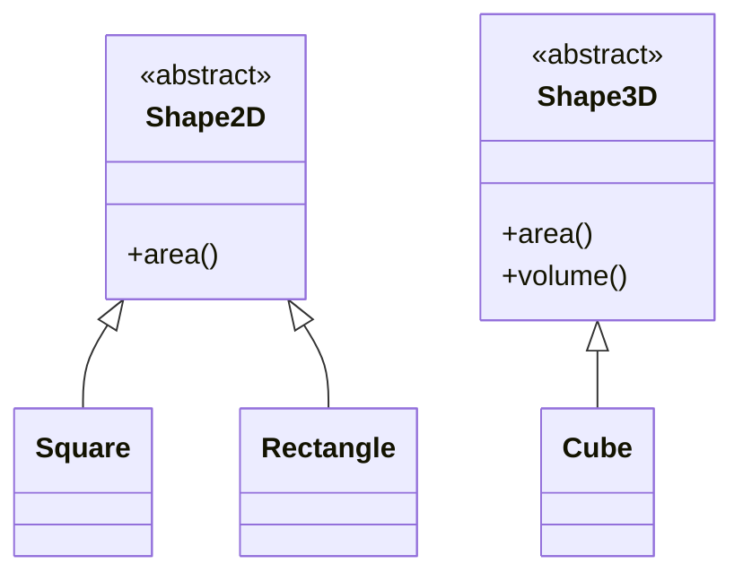

Now:

```text
2D Shape
   ↓
area()

3D Shape
   ↓
area()
+
volume()
```

Therefore:

```text
Square
  ↓
only implements area()

Rectangle
  ↓
only implements area()

Cube
  ↓
implements area() + volume()
```

No class is forced to implement an operation that it does not need.

This is the lecture's complete ISP solution.

---

# 17. 🔑 ISP Mental Model

### ❌ Bad

```text
One huge interface
        ↓
Everyone implements everything
        ↓
Many unnecessary methods
```

### ✅ Good

```text
Large Interface
      ↓
Split into smaller interfaces
      ↓
Each client gets what it actually needs
```

```text
            Interfaces
                │
        ┌───────┴───────┐
        ↓               ↓
      2DShape         3DShape
        ↓               ↓
   Area only       Area + Volume
```

---

# 18. 🔄 Dependency Inversion Principle (DIP)

## Definition

The lecture gives the classic definition:

> **High-level modules should not depend on low-level modules. Both should depend on abstractions.**

Visualized:

### ❌ Without DIP

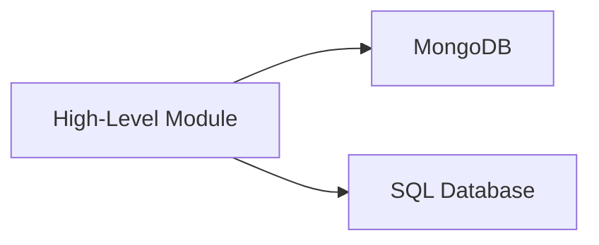

### ✅ With DIP

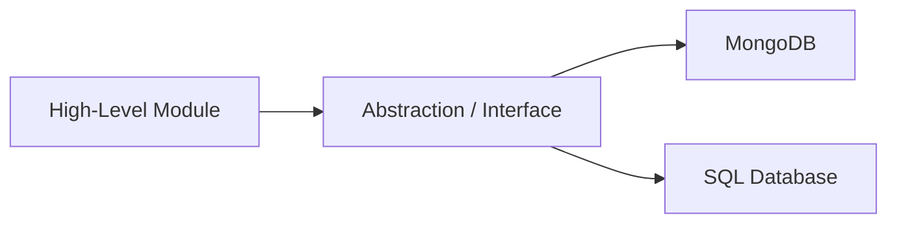

So the architecture becomes:

```text
High-Level Module
        ↓
   Abstraction
        ↓
Low-Level Modules
```

The high-level and low-level modules should communicate through a **contract**, such as an interface or abstract class.

---

# 19. 🏗️ What are High-Level and Low-Level Modules?

The lecture defines them through an application/database example.

### High-Level Module

Deals with:

```text
Business Logic
```

Example:

```text
Application
User Service
Order Service
Payment Logic
```

### Low-Level Module

Deals directly with technical/system resources:

```text
Database
File System
External APIs
```

So:

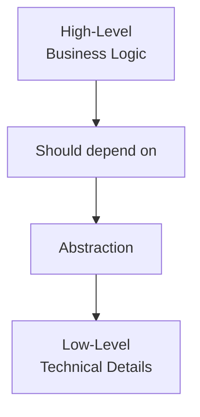

The transcript explicitly classifies database interaction, file-system interaction, and external API interaction as low-level concerns.

---

# 20. 🗄️ DIP Example — Database

Suppose we have:

```text
Application
    |
    +── MongoDB
    |
    +── SQL Database
```

The application directly stores data in both databases:

```text
Application
    ↓
saveToSQL()

Application
    ↓
saveToMongo()
```

This creates tight coupling.

---

## ❌ Problem

Suppose tomorrow:

```text
MongoDB
   ↓
Cassandra
```

Now the application itself must be modified:

```text
Application
   ↓
remove MongoDB code
   ↓
add Cassandra code
   ↓
change methods
```

The lecture connects this to violation of the **Open/Closed Principle**, because the high-level class must be modified whenever the underlying database implementation changes.

---

# 21. ✅ DIP Solution — Persistence Abstraction

Introduce an abstraction:

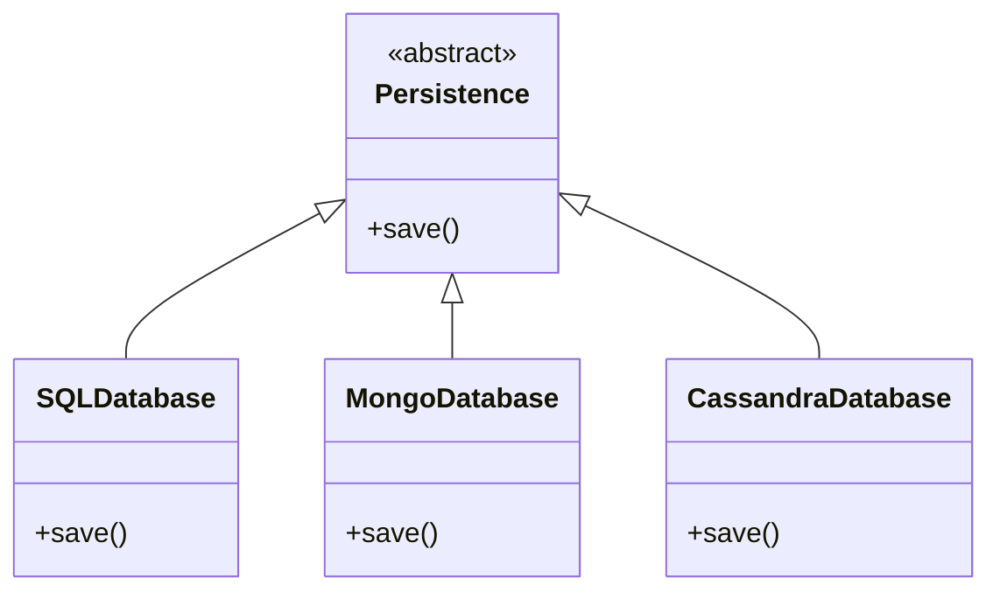

Now:

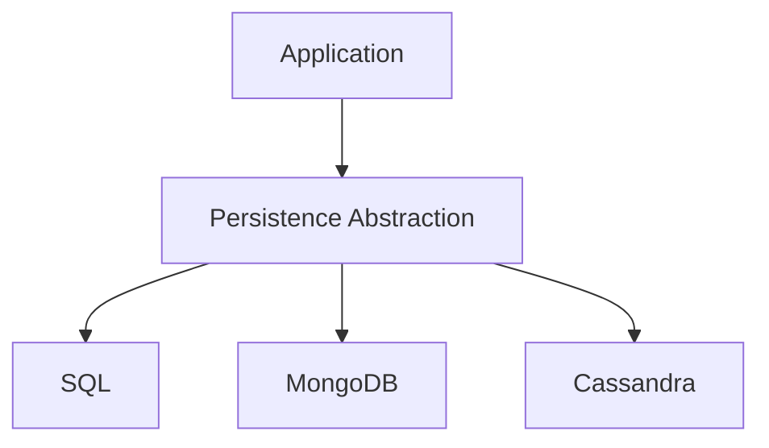

The application no longer cares about the specific implementation.

It only knows:

```text
Persistence.save()
```

---

# 22. 🔌 Polymorphism + Dependency Injection

The lecture explains that the application can receive different implementations dynamically.

For example:

```text
Application
      ↓
Persistence reference
      ↓
┌───────────────┐
│               │
SQL           Mongo
│               │
└───────┬───────┘
        ↓
   Polymorphism
```

At runtime:

```text
Persistence = SQLDatabase
        OR
Persistence = MongoDatabase
        OR
Persistence = CassandraDatabase
```

The application still executes:

```cpp
persistence->save();
```

without needing to know which concrete database implementation is being used.

## The transcript describes this as **dependency injection**: passing the required dependency into the class, for example through its constructor.

# 23. 💉 Dependency Injection

Simple mental model:

```text
Without Dependency Injection

UserService
     ↓
creates MongoDB itself
```

vs.

```text
With Dependency Injection

        Database
           ↑
           │
      UserService
           ↑
           │
     dependency passed in
```

Example:

```cpp
class Database {
public:
    virtual void save(string user) = 0;
    virtual ~Database() = default;
};

class UserService {
private:
    Database* db;

public:
    UserService(Database* db) : db(db) {}

    void storeUser(string user) {
        db->save(user);
    }
};
```

Now:

```cpp
SQLDatabase sql;
MongoDatabase mongo;

UserService service1(&sql);
UserService service2(&mongo);
```

`UserService` does not need to change when the database implementation changes.

---

# 24. 🎯 DIP and OCP Relationship

One of the lecture's key statements is:

```text
If OCP is the TARGET
        ↓
DIP can be the SOLUTION
```

In the lecture's wording:

> **Open/Closed Principle is the target; Dependency Inversion Principle is the solution.**

So:

```mermaid
flowchart LR
    A["Want to keep high-level code closed to modification"]
    A --> B["Introduce abstraction"]
    B --> C["Depend on abstraction"]
    C --> D["Swap implementations"]
    D --> E["OCP preserved"]
```

The transcript explicitly presents this relationship as a key fact to remember.

---

# 25. 👔 Real-Life Analogy for DIP

The lecture uses a company hierarchy.

```mermaid
flowchart TD
    A["CEO<br/>High Level"]
    B["Manager<br/>Abstraction"]
    C["Developers / QA<br/>Low Level"]

    A --> B
    B --> C
```

The CEO should not need to know:

```text
Which developer?
Which QA?
Who joined?
Who left?
```

Instead:

```text
CEO
 ↓
Manager
 ↓
Developers / QA
```

The manager acts as the abstraction layer.

So if developers change:

```text
Developer A
   ↓
Developer B
```

the CEO's interaction remains:

```text
CEO → Manager
```

The CEO does not need to change.

The transcript maps this directly to:

```text
Application
    ↓
Abstraction
    ↓
Database implementation
```

---

# 26. 🧠 Final SOLID Discussion

The lecture ends with an important conceptual question:

> If OOP maps real-world objects into programming objects, why does SOLID insist that a class should have a single responsibility when real-world objects can do many things?

The answer is based on **context**.

---

## 👤 Human Example

A real human can:

```text
Eat
Sleep
Work
Sing
Travel
Drive
...
```

But when represented in a specific application, we only model the behavior relevant to that scenario.

### Office Application

```text
Human
  ↓
work()
```

We do not necessarily need:

```text
sleep()
```

### Home Application

```text
Human
  ↓
sleep()
```

---

# 27. 🚕 Same User, Different Applications

The transcript gives an especially useful example.

### Ola / Uber

A `User` may:

```text
bookRide()
cancelRide()
completeRide()
```

### Swiggy / Zomato

The same conceptual user may instead:

```text
placeOrder()
cancelOrder()
trackOrder()
```

Therefore:

```mermaid
flowchart LR
    U["👤 Real-World User"]

    U --> O["🚕 Ride Application"]
    U --> F["🍔 Food Application"]

    O --> O1["bookRide()"]
    O --> O2["cancelRide()"]

    F --> F1["placeOrder()"]
    F --> F2["cancelOrder()"]
```

The real-world object is complex.

The software model only needs the **behavior relevant to the current application**.

This is how the lecture reconciles real-world objects with SOLID's more focused responsibilities.

---

# 28. ⚖️ SOLID Principles Are Principles, Not Absolute Laws

This is one of the most important final points.

SOLID principles are:

```text
Principles
≠
Strict Laws
```

A real application may not be able to follow every principle perfectly.

Sometimes:

```text
Business Requirement
        ↓
Trade-off
        ↓
Slight SOLID Violation
```

The lecture compares this to DSA:

```text
DSA:
Time ↔ Space Trade-off

LLD:
Design Principle ↔ Business Requirement Trade-off
```

You cannot always optimize every dimension simultaneously.

At the end of the day:

```text
Business Logic
      ↓
must work
```

So sometimes a small deviation from a SOLID principle may be necessary.

However:

```text
More appropriate SOLID usage
        ↓
Cleaner code
        ↓
Easier extension
        ↓
Better scalability
```

The lecture therefore emphasizes using SOLID **as much as practical**, rather than treating it as an absolute law.

---

# 🧠 Final Revision Map

```mermaid
flowchart TD
    A["SOLID"]

    A --> B["LSP"]
    B --> B1["Child must behave like Parent"]
    B --> B2["Signature Rules"]
    B --> B3["Property Rules"]
    B --> B4["Method Rules"]

    B2 --> B21["Arguments"]
    B2 --> B22["Return Type"]
    B2 --> B23["Exceptions"]

    B3 --> B31["Class Invariant"]
    B3 --> B32["History Constraint"]

    B4 --> B41["Precondition"]
    B4 --> B42["Postcondition"]

    A --> C["ISP"]
    C --> C1["Small client-specific interfaces"]
    C --> C2["Don't force unused methods"]

    A --> D["DIP"]
    D --> D1["High-level → Abstraction"]
    D --> D2["Low-level → Abstraction"]
    D --> D3["Dependency Injection"]
    D --> D4["Loose Coupling"]
```

---

# 📌 One-Page Cheat Sheet

## LSP

```text
Child must be substitutable for Parent
```

### Signature

```text
Arguments  → preserve compatible contract
Return     → same / narrower
Exception  → same / more specific
```

### Properties

```text
Class Invariant
→ preserve the always-true rule

History Constraint
→ do not break established parent behavior
```

### Methods

```text
Precondition
→ Child can weaken, not strengthen

Postcondition
→ Child can strengthen, not weaken
```

---

## ISP

```text
❌ One huge interface

✅ Many focused interfaces
```

> Don't force a class to implement methods it does not need.

---

## DIP

```text
❌ High-Level → Concrete Low-Level

✅ High-Level
       ↓
  Abstraction
       ↓
Low-Level Implementations
```

> Depend on abstractions, not implementation details.

---

# 🔥 Interview Memory Tricks

### LSP

```text
Parent says:
"You must accept this."

Child:
"I can accept the same or more."
```

```text
Parent promises:
"You will get this result."

Child:
"I will provide the same or more."
```

Therefore:

```text
PRE  → WEAKER is okay
POST → STRONGER is okay
```

---

### ISP

```text
Don't give every client
a giant interface.

Give each client
what it actually needs.
```

---

### DIP

```text
Business Logic
      ↓
   Interface
      ↓
Concrete Implementation
```

---

# 🏁 Final Mental Model

```text
                         SOLID
                           │
           ┌───────────────┼───────────────┐
           │               │               │
          LSP             ISP             DIP
           │               │               │
     Substitutability   Small APIs    Abstraction
           │               │               │
   ┌───────┼───────┐       │          Loose Coupling
   │       │       │       │               │
Signature Property Method  │        Dependency Injection
   │       │       │        │               │
Args     Invariant Pre      │           Polymorphism
Return   History   Post     │               │
Exception                 No unused       OCP support
                         methods
```

## ⭐ The Lecture's Core Message

> **LSP:** A child should genuinely behave like its parent.

> **ISP:** Don't force clients to depend on methods they don't need.

> **DIP:** High-level and low-level modules should communicate through abstractions.

> **SOLID:** These are design principles that help produce cleaner, extensible, and maintainable code, but they must be balanced against actual business requirements.
