# 🧩 Low-Level Design (LLD)

> **LLD = Designing the internal structure of an application using classes, objects, relationships, responsibilities, interfaces, and design principles.**

---

## 🌟 What is LLD?

Low-Level Design focuses on **how the code inside a system is structured**.

It deals with:

* Classes
* Objects
* Methods
* Interfaces
* Relationships
* Responsibilities
* OOP principles
* Design patterns

The goal is to create a design that is:

**Scalable → Maintainable → Reusable**

---

# 🏛️ Three Pillars of LLD

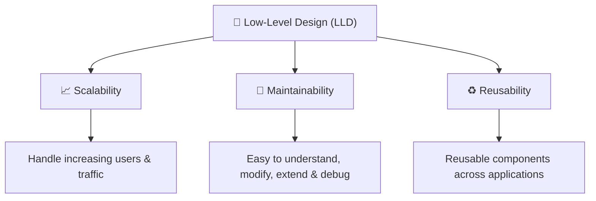

---

## 📈 1. Scalability

### Question to ask

> **What happens if millions of users start using the application?**

The design should allow the application to sustain increasing traffic and users.

```text
10 Users
   ↓
100 Users
   ↓
1,000 Users
   ↓
10,000 Users
   ↓
100,000 Users
   ↓
Millions of Users
```

A scalable design should allow the system to **grow without requiring a complete redesign**.

---

## 🔧 2. Maintainability

A good design should make the code easy to:

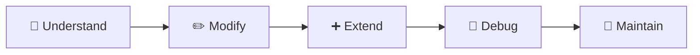

The goal is to make future changes easier and reduce the chance of breaking existing functionality.

---

## ♻️ 3. Reusability

Components should ideally be reusable across:

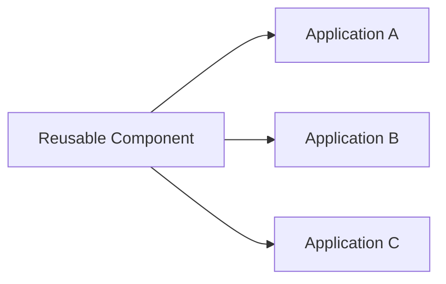

> **Build components that can be reused instead of unnecessarily duplicating the same logic.**

---

# ⚖️ LLD vs HLD

## 🏗️ What does HLD focus on?

**HLD = High-Level Design**

It focuses primarily on **system architecture**.

Typical HLD concerns include:

### 💻 Technology Stack

```text
Java
   ↓
Spring Boot
```

### 🗄️ Database

```text
SQL
   │
   ├── PostgreSQL
   ├── MySQL
   │
   └── OR
       
NoSQL
   │
   ├── MongoDB
   └── Cassandra

        ↓

      Hybrid
```

### 🖥️ Server Scaling

How the system handles increasing traffic and workload.

---

## 🔍 LLD vs HLD

| 🧩 LLD           | 🏗️ HLD              |
| ---------------- | -------------------- |
| Classes          | Architecture         |
| Objects          | Servers              |
| Methods          | System Communication |
| Interfaces       | Databases            |
| Relationships    | Scaling              |
| Responsibilities | Technology Stack     |
| Design Patterns  | Cost                 |
| OOP              | Infrastructure       |

### 🧠 Easy Mental Model

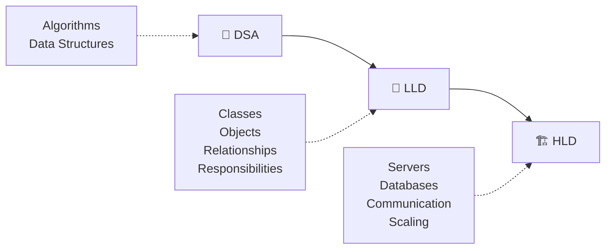

> **DSA → Algorithms & Data Structures**
> **LLD → Code Structure**
> **HLD → System Architecture**

---

# 🚀 How to Approach an LLD Problem

Don't start coding immediately.

Use this flow:

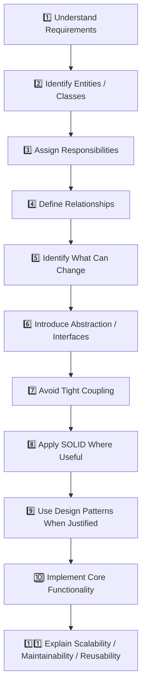

---

# 1️⃣ Understand Requirements

Before designing anything, understand:

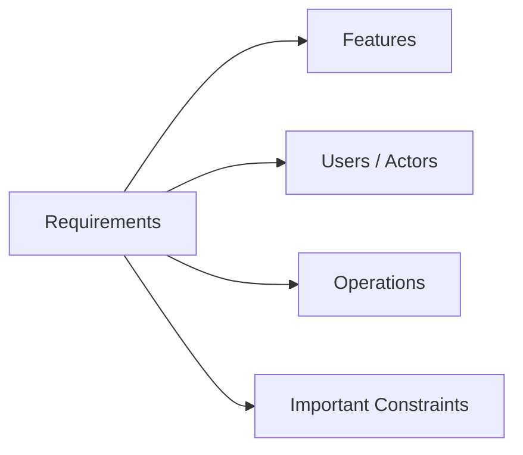

Ask yourself:

* What should the system do?
* Who interacts with it?
* What operations are required?
* What are the major use cases?

> **First understand the problem, then design the solution.**

---

# 2️⃣ Identify Entities / Classes

Find the important **real-world entities** in the problem.

### Example: Food Ordering System

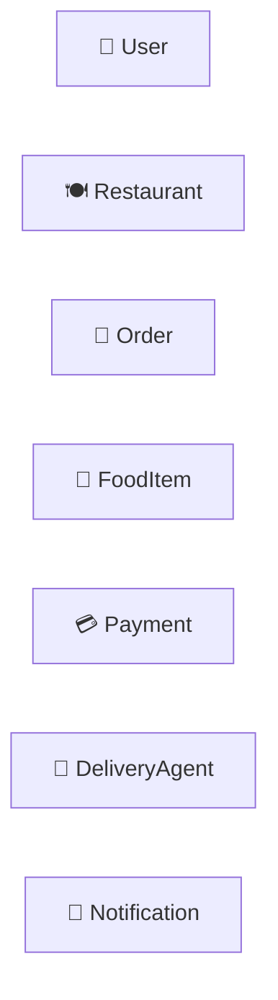

These entities can become the primary classes in your design.

---

# 3️⃣ Assign Responsibilities

Now ask:

> **What should each class be responsible for?**

Example:

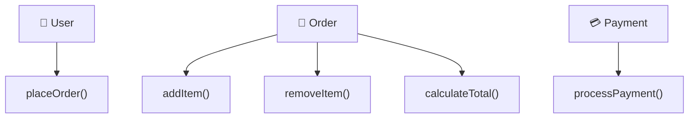

### Core idea

```text
One class
    ↓
Clear responsibility
    ↓
Less complexity
    ↓
Easier maintenance
```

---

# 4️⃣ Define Relationships

Once classes are identified, determine how they interact.

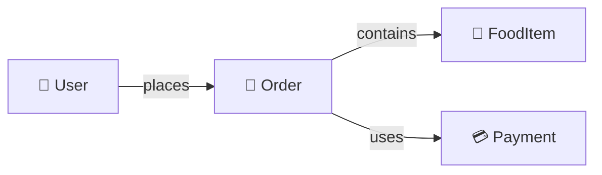

Common relationships to identify:

```text
Association
Aggregation
Composition
Inheritance
Dependency
```

---

# 5️⃣ Identify What Can Change

This is one of the **most important questions in LLD**.

Ask:

> **Which part of the system is likely to change?**

### Example: Payment

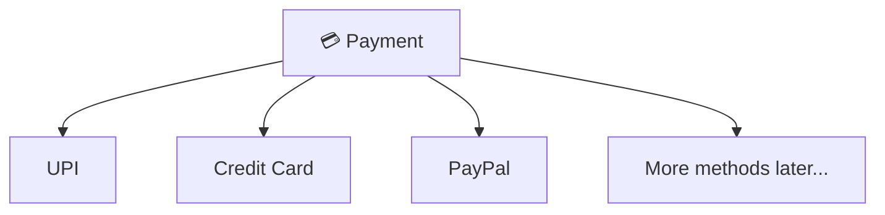

Payment methods can change or new methods can be added.

Therefore, we should avoid tightly coupling the entire application to one specific payment implementation.

---

# 6️⃣ Introduce Abstraction / Interfaces

When multiple implementations can exist, introduce an abstraction.

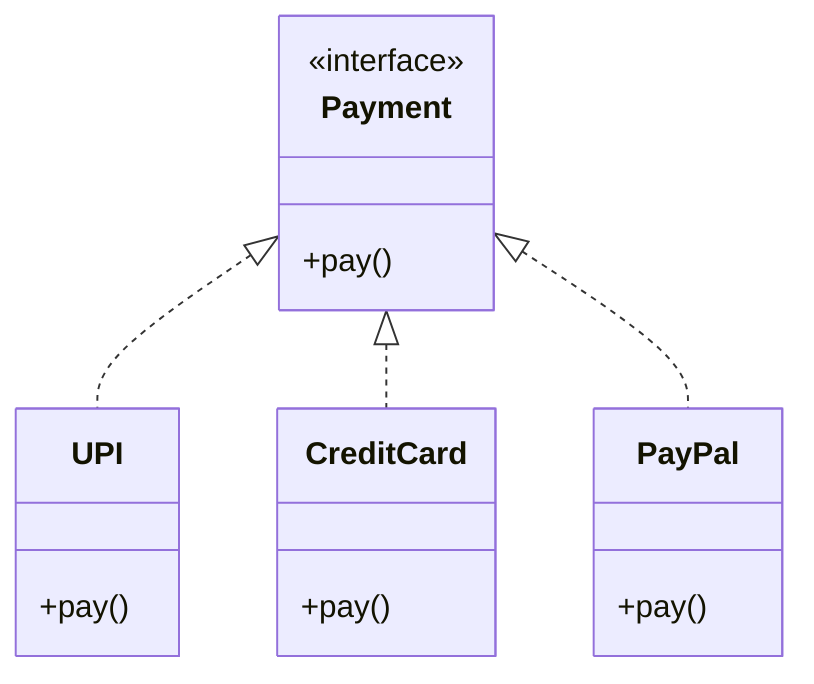

Now the rest of the application can depend on:

```text
Payment
   ↓
Interface / Abstraction
```

instead of directly depending on:

```text
UPI
CreditCard
PayPal
```

---

# 7️⃣ Avoid Tight Coupling

## ❌ Tight Coupling

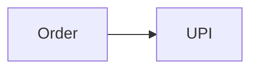

`Order` directly depends on `UPI`.

Changing the payment implementation can require changes in `Order`.

---

## ✅ Loose Coupling

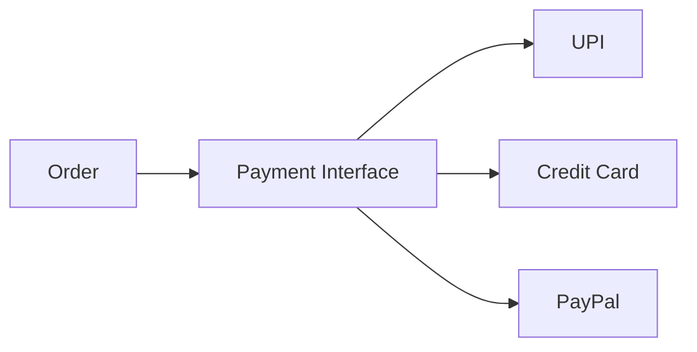

Now:

```text
Order
  ↓
Payment Interface
  ↓
Different Implementations
```

This makes the design easier to extend and maintain.

---

# 8️⃣ Apply SOLID Where Useful

Don't force every SOLID principle into every problem.

Use a principle when it solves a real design issue.

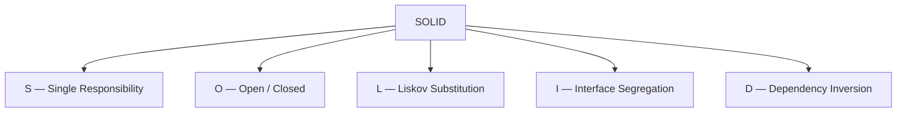

### S — Single Responsibility

> One class should have one primary responsibility.

### O — Open / Closed

> Open for extension, closed for unnecessary modification.

### L — Liskov Substitution

> Derived objects should be usable where the base abstraction is expected.

### I — Interface Segregation

> Prefer small, focused interfaces over unnecessarily large interfaces.

### D — Dependency Inversion

> Depend on abstractions rather than concrete implementations.

---

# 9️⃣ Use Design Patterns When Justified

Design patterns should **solve a design problem**.

Don't use a pattern just because you know it.

Common LLD patterns:

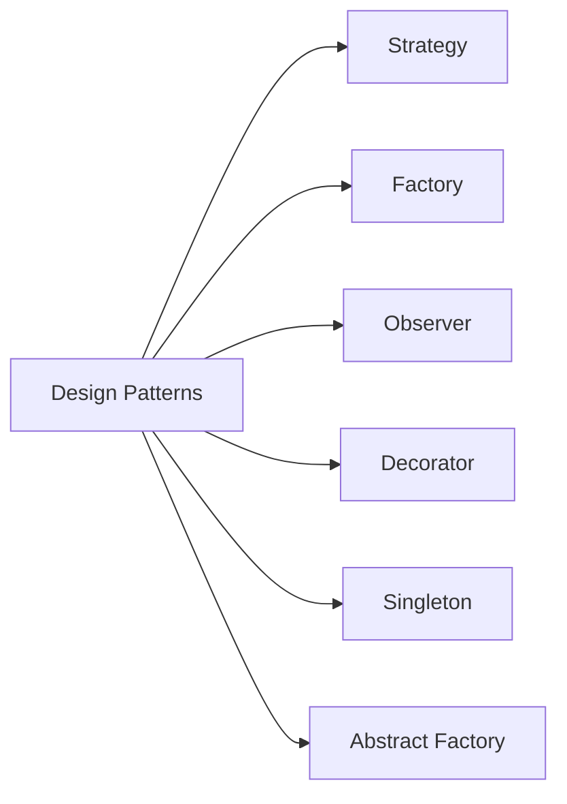

### 🧠 Important Rule

```text
Requirement
    ↓
Design Problem
    ↓
Choose Pattern
```

Not:

```text
Pattern
    ↓
Force it into the problem ❌
```

---

# 🔟 Implement Core Functionality

Once the design is clear, start coding.

Focus on:

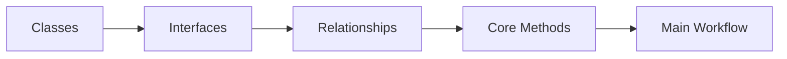

You don't need to implement every possible feature immediately.

First demonstrate that the **core use case works correctly**.

---

# 1️⃣1️⃣ Explain Your Design

At the end of the interview, connect your design to the three pillars.

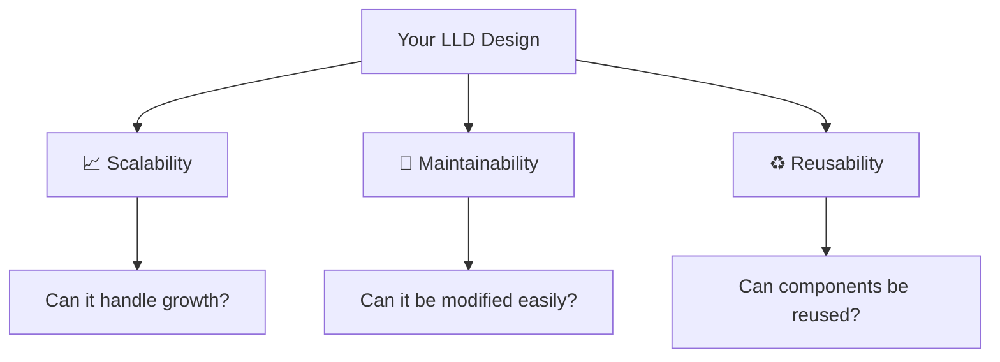

---

# 🎯 The Complete LLD Mindset

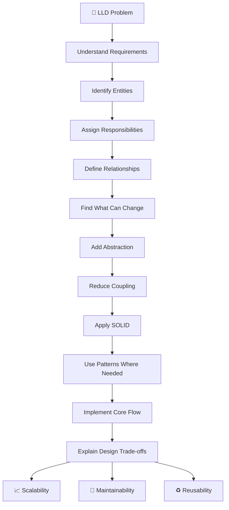

---

# 🧠 What Should You Think During an Interview?

When the interviewer gives you an LLD problem:

```text
❌ Don't immediately think:
"Which code should I write?"

✅ Think:

What are the objects?
        ↓
What does each object do?
        ↓
How are these objects related?
        ↓
What responsibilities belong to which class?
        ↓
What is likely to change?
        ↓
Where do I need abstraction?
        ↓
How can I reduce coupling?
        ↓
Is there a pattern that naturally solves this?
        ↓
Can I implement the core workflow?
```

---

# 🏁 Final Cheat Sheet

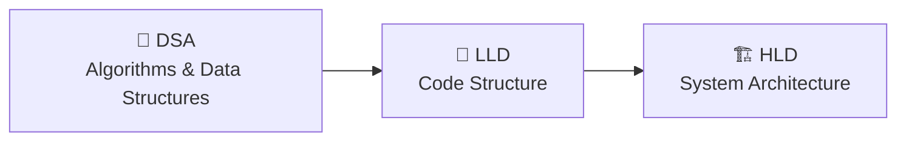

### Remember

> 🧠 **DSA = Brain**
> 🦴 **LLD = Skeleton**
> 🏗️ **HLD = Overall Architecture**

And for an LLD interview:

> **Requirements → Classes → Responsibilities → Relationships → Change → Abstraction → Loose Coupling → SOLID → Patterns → Code → Design Discussion**

---

### ⭐ Core Principle

> **Good LLD is not about writing the most code.**
> **It is about creating a clean structure in which the code is easy to understand, change, extend, and reuse.**
